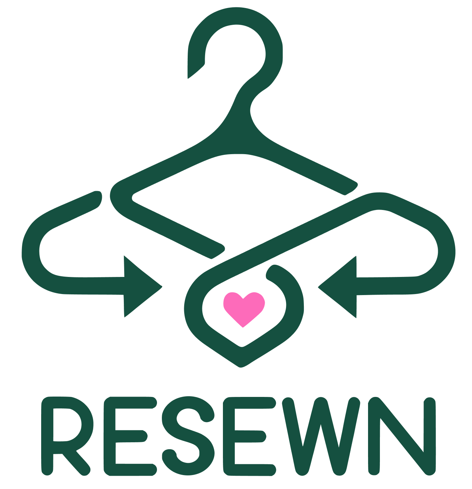

# Resewn

Resewn is a platform which allows customers to buy and donate secondhand clothes. We will partner with sustainable clothing brands in order to upcycle our products which are then sold on our platform or recycled another way, leading to 100% recycled products.


## Tools Used
This project was created using React on the front end and Flask on the backend.

Our program also uses pretrained AI models from `sentence-transformers` in order to match user style preferences to our existing products by using word embeddings.

## Building the Project

To build the project, clone this repository
```
git clone https://github.com/stefantzn/Resewn.git
```

To start only the web service, you can run
```
npm run start
```

To start the backend, you will have to ensure that you have all the packages need. Refer to the backend guide in the `backend` folder to see a more comprehensive guide to running the backend. To start the server, in the `backend` directory, run
```
python3 server.py
```

## Learn More

You can learn more Resewn in our [pitch presentation](https://www.canva.com/design/DAF_g6dhHkM/UTNHH4SHX4pKNkA7LB6mCg/edit?utm_content=DAF_g6dhHkM&utm_campaign=designshare&utm_medium=link2&utm_source=sharebutton).

## About
Resewn was a project created for Hack the Globe 2024. The team behind the project consists of Daniel Tran, Laura Madill, Stefan Tuczynski, and Harry He.
